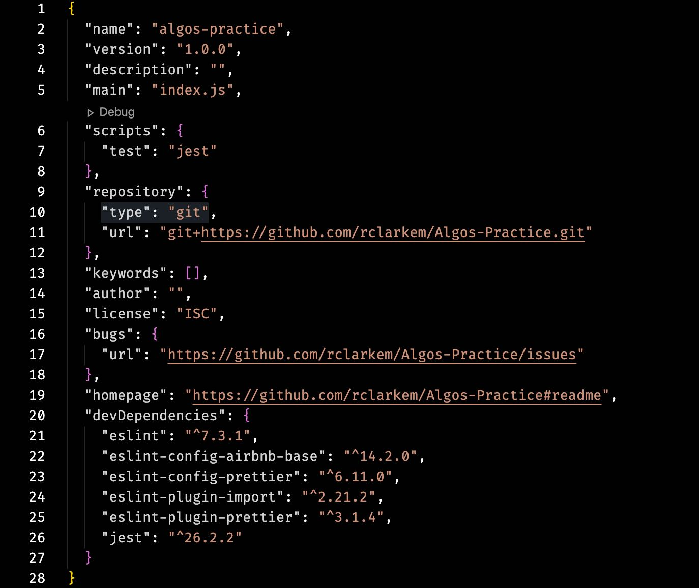
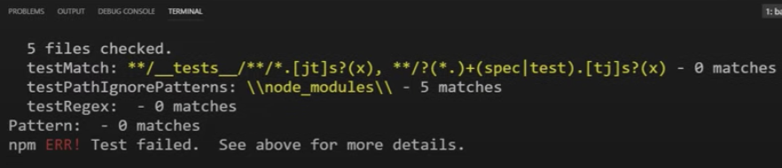
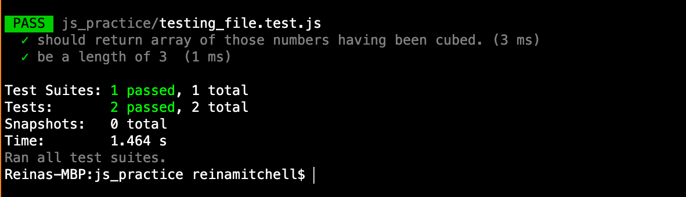
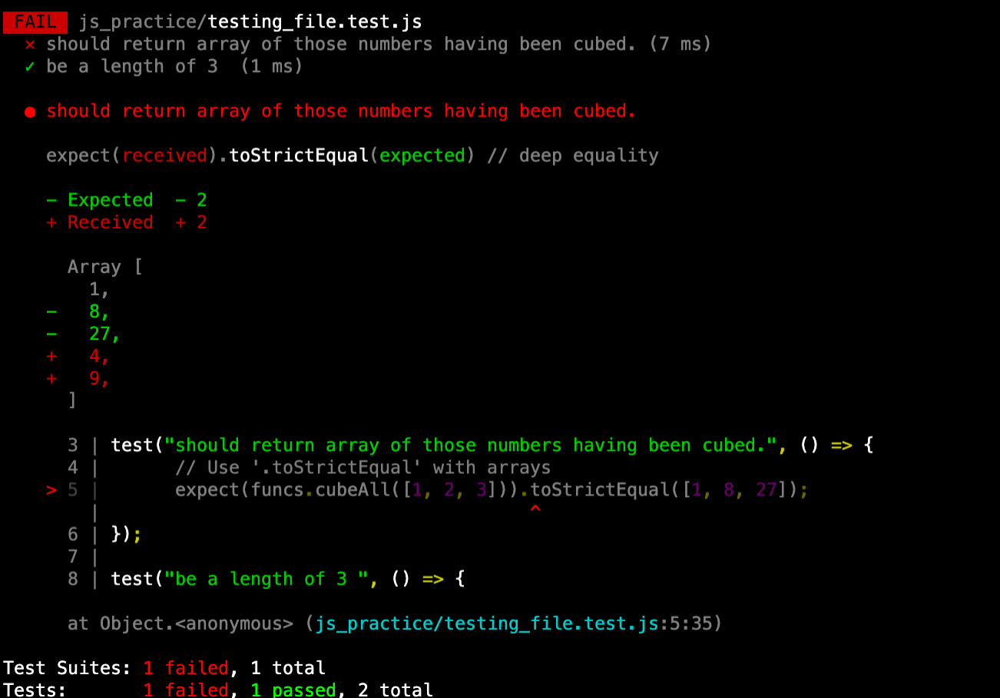

# Getting Started With Testing in JavaScript

## Using the Jest Testing Library

In order to start with Jest, you need to make sure it is saved as a dependency in your `package.json` . If your project does not have a `package.json` file already, in your terminal run:

`npm init -y`

This will initialize the `package.json` with the default values.

From here, we are going to add Jest to our `package.json`. In your terminal, write:

`npm i --save-dev jest`

We are going to save it as a dev dependency because we are only using it when we are developing our project.

Now, go inside of that package.json and under `"scripts"`, where it says `"tests"` , write in: `"jest"`.



To see if it is working, run: `npm test`



You should see that it says ‘Test failed’, but that is because we haven’t written any tests or code to test against.

## Let’s add some code and write our tests

I have already gone ahead and created a file called `testing_file.js` . In that file, I have two functions called `map` and `cubeAll`.

The `map` is a higher-order function. It takes two arguments: _an array_ and a _callback function_. It will iterate over each element in the array, applying a callback function to each element. It should then return a new array whose elements are the result of applying the callback function to each element in the input array.

`cubeAll` takes one argument: _an array_. It calls the `map` function inside of it. `cubeAll` will return an array of those numbers having been cubed. At the bottom of the file, I added in exports so that I can import it into the file that will contain our tests.

---

## `testing_file.js`

```javascript
/*
Here we have a higher order function called 'map'. It takes two arguments: an array and a callback function.

It will iterate over each element in the array, applying the callback function to each element. It should then return a new array whose elements are the result of applying the callback function to each element in the input array.

cubeAll takes one argument: an array. And it calls the map function inside of it. 

cubeAll will return an array of those numbers having been cubed.  

*/

function map(array, callbackFunction) {
	var newArray = [];

	for (var i = 0; i < array.length; i++) {
		newArray.push(callbackFunction(array[i]));
	}

	return newArray;
}

function cubeAll(arrOfNumbers) {
	return map(arrOfNumbers, function (n) {
		return n ** 3;
	});
}

exports.map = map;
exports.cubeAll = cubeAll;
```

We will then create our test file. We will name is `testing_file.test.js.`

We will import our functions into the new test file.

---

### `testing_file.test.js`

```javascript
const funcs = require("./testing_file.js");
```

Now we want to test that the `cubeAll` function is working. We want to see that whatever array gets passed in, all the elements should be cubed and result in a new array.

Jest has a built-in function called `test` and it takes two arguments: the _test description_ and a _function_. We will see the test description in the console and it will let us know what test is being run.

The second argument is what gets called to run the test. Inside this function, we will call the `cubeAll` function with its parameters. Jest has keywords that we will use inside of our function called `expect` and`.toStrictEqual`. Since we are working with arrays, I will use `.toStrictEqual` , but depending on what you are testing, this matcher may be different. Check out the [docs](https://jestjs.io/) in Jest, to see what matchers you should be using.

---

### `testing_file.test.js`

```javascript
const funcs = require("./testing_file.js");

test("should return array of those numbers cubed.", () => {
	// Use '.toStrictEqual' with arrays
	expect(funcs.cubeAll([1, 2, 3])).toStrictEqual([1, 8, 27]);
});

test("be a length of 3 ", () => {
	expect(funcs.cubeAll([1, 2, 3]).length).toBe(3);
});
```

Let me explain the syntax if this looks a little confusing.

The first argument is my _test description_ as a string. My test describes that I want **the original array’s elements to be returned in a new array with those elements cubed**.

I **expect** the result of`cubeAll` function with the passed in parameter `[1,2,3]` to **be strictly equal** to `[1,8,27]`.

_(you can input whatever you want as the parameter. I just happened to write_ `[1,2,3]`)

My second test **expects** the resulting array **to be** the same length as three.

Now we will run `npm test`.



As you can see my tests have passed, and we can see in the console what tests exactly passed.

The great thing about this library is that it will also show you what your values are if the tests fail.



We can clearly see which tests did not pass and it will show us in green the expected result and in red what the actual result was. My array was supposed to equal `[1,8,27]` but instead, it returned `[1,4,9]`.

## Why Are We Writing Tests?

This way of testing is called unit testing. We are checking every small piece of code and the reason is that it makes finding buggy code easier. Ultimately, it makes the process of writing larger codebases more efficient. It may be time-consuming initially, but it is better to have short term pain now than to write a bunch of code and later on not really know where something might be wrong.

For instance, what if I accidentally wrote inside of the `cubeAll` function `n * n` instead of `n ** 3`.Well, when I wrote my test of “should return array of those numbers cubed”, it would fail and then I could see what the expected result was against what I actually received.

Now you might ask, couldn't I just `console.log` the function and see that I didn't get the right result? Yes, you could, but what if you know that your function may have multiple edge cases? What if you will be constantly change things within that code but still want the same output. In other words, it is easier to write out test cases than to have to constantly `console.log` everything.

Also, think about when you are working with other developers. If I sent this code to someone else, they could automatically see what exactly I am testing, and every time they make a change or add something to the functions, the tests would be there for them to use as well. And while you obviously cannot test for everything, it does make writing cleaner code easier.

## Conclusion

I hope this was a helpful introduction on how to get started writing your own tests. Check out the [Jest library](https://jestjs.io/docs/en/getting-started) for more information.
